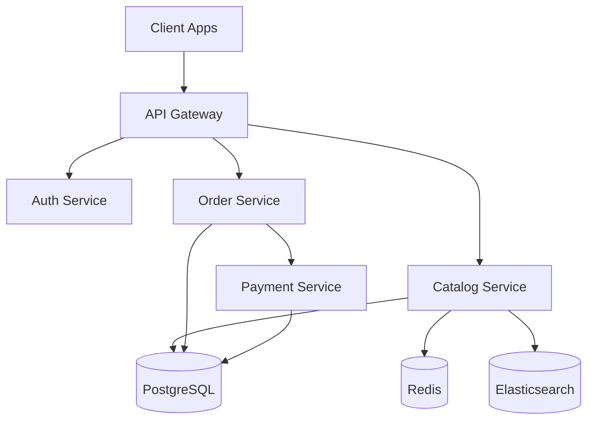
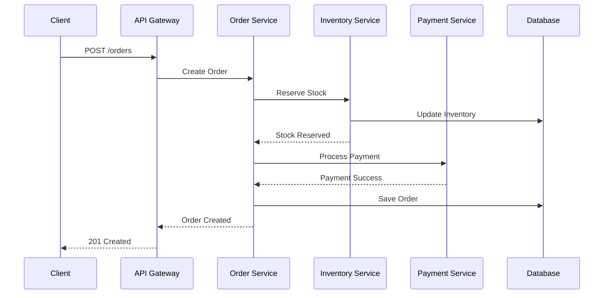

# Documentação

**Gerado por**: `/swe-substrate-documentation`
**Data**: 2025-10-29

## Estratégia de Documentação

### Níveis de Documentação

1. **Code Comments**: Explicações inline no código
2. **JSDoc/TSDoc**: Documentação de API e funções
3. **README Files**: Visão geral de módulos e features
4. **API Documentation**: OpenAPI/Swagger, GraphQL schema
5. **Architecture Docs**: ADRs, diagramas de arquitetura
6. **Runbooks**: Guias operacionais e troubleshooting

## Comentários no Código

### Quando Comentar

**Comente quando:**
- Lógica complexa ou não-óbvia
- Workarounds temporários
- Decisões de design importantes
- Limitações conhecidas
- Referências a issues/tickets

**Não comente quando:**
- O código é autoexplicativo
- Renomear variáveis/funções seria mais claro
- Repetindo o que o código já diz

### Bons Comentários

```typescript
// GOOD: Explains WHY, not WHAT
// Reserve inventory for 15 minutes to prevent overselling during checkout.
// After this time, the reservation expires and stock becomes available again.
const RESERVATION_TIMEOUT_MS = 15 * 60 * 1000;

// GOOD: Documents complex business logic
/**
 * Calculate shipping cost based on weight tiers and destination.
 *
 * We use a tiered pricing model:
 * - 0-1kg: Base rate
 * - 1-5kg: Base rate + R$ 5 per kg
 * - 5kg+: Base rate + R$ 3 per kg (volume discount)
 *
 * Remote areas (North region) have 20% surcharge due to logistics costs.
 */
function calculateShipping(weight: number, destination: Address): number {
  // Implementation
}

// GOOD: Temporary workaround with context
// TODO(#456): Remove this workaround once Stripe API v2 is stable.
// Current workaround: Retry payment intent creation on 429 errors.
if (error.code === 'rate_limit_exceeded') {
  await sleep(1000);
  return retryPaymentIntent();
}
```

### Comentários Ruins

```typescript
// BAD: States the obvious
// Increment counter by 1
counter++;

// BAD: Outdated comment (misleading)
// Returns user by ID
function getUserByEmail(email: string) { ... }

// BAD: Should be fixed, not commented
// This doesn't work but leaving it here
// const total = calculateTotal(cart);
```

## TSDoc / JSDoc

### Function Documentation

```typescript
/**
 * Creates a new order and processes payment.
 *
 * This function orchestrates the entire order creation flow:
 * 1. Validates cart items availability
 * 2. Reserves inventory
 * 3. Processes payment via selected gateway
 * 4. Creates order record
 * 5. Sends confirmation email
 *
 * @param customerId - The ID of the customer placing the order
 * @param cartId - The ID of the cart to convert to an order
 * @param paymentMethod - The selected payment method
 * @returns The created order with payment status
 * @throws {ValidationError} If cart is empty or items are unavailable
 * @throws {PaymentError} If payment processing fails
 * @throws {InventoryError} If inventory reservation fails
 *
 * @example
 * ```typescript
 * const order = await createOrder('cust_123', 'cart_456', {
 *   type: 'credit_card',
 *   cardToken: 'tok_visa',
 * });
 * console.log(order.id); // 'ord_789'
 * ```
 *
 * @see {@link OrderService.processPayment} for payment processing details
 * @see {@link InventoryService.reserveStock} for inventory reservation
 */
async function createOrder(
  customerId: string,
  cartId: string,
  paymentMethod: PaymentMethod
): Promise<Order> {
  // Implementation
}
```

### Class Documentation

```typescript
/**
 * Service for managing product inventory across multiple warehouses.
 *
 * Responsibilities:
 * - Track available stock per warehouse
 * - Reserve inventory during checkout (15-minute timeout)
 * - Release expired reservations
 * - Sync with external warehouse management system
 *
 * @remarks
 * This service uses pessimistic locking to prevent race conditions
 * when multiple customers try to purchase the last item.
 *
 * @example
 * ```typescript
 * const inventory = new InventoryService();
 *
 * // Check availability
 * const available = await inventory.checkAvailability('prod_123');
 *
 * // Reserve stock
 * const reservation = await inventory.reserve('prod_123', 2);
 * ```
 */
export class InventoryService {
  // Implementation
}
```

### Type Documentation

```typescript
/**
 * Represents a product in the catalog.
 *
 * @property id - Unique product identifier (UUID v4)
 * @property name - Display name (max 255 chars)
 * @property basePrice - Price in cents (e.g., 9990 = R$ 99.90)
 * @property category - Product category for navigation and filters
 * @property customizationOptions - Available customizations (engraving, colors, etc.)
 */
export interface Product {
  id: string;
  name: string;
  description?: string;
  basePrice: number;
  currency: 'BRL' | 'USD';
  category: Category;
  images: Image[];
  customizationOptions?: CustomizationOption[];
  createdAt: Date;
  updatedAt: Date;
}
```

## README Files

### Module README Structure

**src/services/payment/README.md**

```markdown
# Payment Service

Service for processing payments through multiple payment gateways.

## Supported Gateways

- Stripe (credit/debit cards)
- PayPal (PayPal balance and cards)
- Mercado Pago (Brazilian market)

## Usage

```typescript
import { PaymentService } from './payment-service';

const paymentService = new PaymentService();

const result = await paymentService.processPayment({
  orderId: 'ord_123',
  amount: 9990, // R$ 99.90 in cents
  paymentMethod: {
    type: 'credit_card',
    token: 'tok_visa_4242',
  },
});

if (result.status === 'succeeded') {
  console.log('Payment successful:', result.transactionId);
}
```

## Configuration

Required environment variables:

```bash
STRIPE_SECRET_KEY=sk_live_xxxxx
PAYPAL_CLIENT_ID=xxxxx
PAYPAL_SECRET=xxxxx
MERCADOPAGO_ACCESS_TOKEN=xxxxx
```

## Error Handling

All payment errors extend `PaymentError`:

- `PaymentDeclinedError`: Card declined by bank
- `InsufficientFundsError`: Insufficient balance
- `GatewayTimeoutError`: Payment gateway timeout

## Testing

Use test cards in development:

- Visa Success: `4242 4242 4242 4242`
- Visa Decline: `4000 0000 0000 0002`

Run tests:

```bash
npm run test:integration -- payment
```
```

## Architecture Decision Records (ADRs)

### ADR Template

**docs/adr/0001-use-postgresql-for-primary-database.md**

```markdown
# ADR 0001: Use PostgreSQL for Primary Database

## Status

Accepted

## Context

We need a relational database for storing transactional data (orders, products, customers).

Options considered:
- PostgreSQL
- MySQL
- MongoDB

## Decision

We will use PostgreSQL 15 as our primary database.

## Rationale

**Pros:**
- Strong ACID compliance for financial transactions
- Excellent JSON support (JSONB) for flexible schemas
- Rich ecosystem and tooling
- Great performance with proper indexing
- Native support for complex queries and joins
- Team has PostgreSQL expertise

**Cons:**
- Slightly more complex to set up than MySQL
- Less familiar to some team members vs MongoDB

**PostgreSQL vs MySQL:**
- Better JSON support (JSONB vs JSON text)
- More advanced features (CTEs, window functions)
- Better full-text search

**PostgreSQL vs MongoDB:**
- Strong consistency guarantees needed for payments
- Complex queries with joins required
- Mature transaction support

## Consequences

### Positive
- Reliable transactional guarantees for orders/payments
- Flexible schema evolution with JSONB
- Strong community support

### Negative
- Need to manage migrations carefully
- Requires proper indexing strategy for performance
- Team needs training on advanced PostgreSQL features

## Related Decisions

- ADR 0003: Use Redis for caching
- ADR 0005: Use Elasticsearch for product search
```

### ADR Index

**docs/adr/README.md**

```markdown
# Architecture Decision Records

## Active ADRs

- [ADR 0001](0001-use-postgresql-for-primary-database.md) - Use PostgreSQL for Primary Database
- [ADR 0002](0002-microservices-architecture.md) - Adopt Microservices Architecture
- [ADR 0003](0003-use-redis-for-caching.md) - Use Redis for Caching Layer
- [ADR 0004](0004-jwt-authentication.md) - Use JWT for Authentication
- [ADR 0005](0005-elasticsearch-for-search.md) - Use Elasticsearch for Product Search

## Superseded ADRs

- [ADR 0000](0000-monolithic-architecture.md) - ~~Monolithic Architecture~~ (superseded by ADR 0002)
```

## API Documentation

### OpenAPI/Swagger

**swagger.yaml**

```yaml
openapi: 3.0.0
info:
  title: ShopFlow API
  version: 1.2.3
  description: E-commerce platform API
  contact:
    name: ShopFlow Engineering
    email: engineering@shopflow.com

servers:
  - url: https://api.shopflow.com/v1
    description: Production
  - url: https://staging-api.shopflow.com/v1
    description: Staging

paths:
  /products:
    get:
      summary: List products
      description: Returns a paginated list of products with optional filters
      parameters:
        - name: category
          in: query
          schema:
            type: string
          description: Filter by category
        - name: limit
          in: query
          schema:
            type: integer
            default: 20
            maximum: 100
          description: Number of results per page
      responses:
        '200':
          description: Successful response
          content:
            application/json:
              schema:
                type: object
                properties:
                  data:
                    type: array
                    items:
                      $ref: '#/components/schemas/Product'
                  pagination:
                    $ref: '#/components/schemas/Pagination'

components:
  schemas:
    Product:
      type: object
      required:
        - id
        - name
        - price
      properties:
        id:
          type: string
          format: uuid
          example: '123e4567-e89b-12d3-a456-426614174000'
        name:
          type: string
          example: 'Premium T-Shirt'
        price:
          type: integer
          description: Price in cents
          example: 8990
```

### Generating Docs from Code

```typescript
// Using tsoa for automatic Swagger generation
import { Get, Route, Tags } from 'tsoa';

@Route('products')
@Tags('Products')
export class ProductController {
  /**
   * Retrieve a list of products
   * @summary List products
   * @param category Filter by category
   * @param limit Results per page (max 100)
   */
  @Get()
  public async getProducts(
    @Query() category?: string,
    @Query() limit: number = 20
  ): Promise<ProductListResponse> {
    // Implementation
  }
}
```

## Diagramas

### Architecture Diagrams

**Using Mermaid**



### Sequence Diagrams



## Runbooks

### Runbook Template

**docs/runbooks/payment-failures.md**

```markdown
# Runbook: Payment Processing Failures

## Symptoms

- Spike in payment failure rate (>5%)
- Alert: "Payment failures exceeding threshold"
- Customer reports of failed checkouts

## Impact

- Lost revenue
- Poor customer experience
- Potential cart abandonment

## Diagnosis

### 1. Check Datadog Dashboard

- Navigate to "Payment Processing" dashboard
- Check error rate by payment gateway
- Look for error patterns (specific error codes)

### 2. Check Sentry

- Filter errors by tag: `component:payment`
- Look for recent spikes
- Check error messages and stack traces

### 3. Verify External Services

- Check Stripe status: https://status.stripe.com
- Check PayPal status: https://www.paypal-status.com

### 4. Check Database

```sql
-- Recent failed payments
SELECT
  payment_method,
  error_code,
  COUNT(*) as count
FROM payments
WHERE created_at > NOW() - INTERVAL '1 hour'
  AND status = 'failed'
GROUP BY payment_method, error_code
ORDER BY count DESC;
```

## Resolution Steps

### If Stripe is down:
1. Enable maintenance mode for Stripe payments
2. Show alternative payment methods to customers
3. Monitor Stripe status page

### If high decline rate:
1. Check for fraud detection rules
2. Review recent code deployments
3. Contact payment gateway support

### If database issues:
1. Check connection pool status
2. Review slow query log
3. Scale database if needed

## Prevention

- Implement retry logic with exponential backoff
- Set up payment gateway fallbacks
- Monitor payment success rate
- Regular load testing

## Related

- [Payment Service Documentation](../services/payment/README.md)
- [ADR 0008: Payment Gateway Selection](../adr/0008-payment-gateway-selection.md)
```

## Changelog

### CHANGELOG.md

```markdown
# Changelog

All notable changes to this project will be documented in this file.

The format is based on [Keep a Changelog](https://keepachangelog.com/en/1.0.0/),
and this project adheres to [Semantic Versioning](https://semver.org/spec/v2.0.0.html).

## [1.2.3] - 2025-10-29

### Added
- Product recommendations based on purchase history
- Multi-warehouse inventory support
- Bulk order discount pricing

### Changed
- Improved checkout page load time by 40%
- Updated Stripe SDK to v12.0
- Migrated to PostgreSQL 15

### Fixed
- Cart abandonment email sending twice
- Race condition in inventory reservation
- Payment webhook signature verification

### Security
- Updated dependencies with security vulnerabilities
- Implemented rate limiting on auth endpoints

### Deprecated
- `getProduct()` - Use `getProductById()` instead (removal in v2.0.0)

## [1.2.2] - 2025-10-15

### Fixed
- Critical bug in payment processing for international cards
```

## Documentation Maintenance

### Review Schedule

- **Code comments**: Reviewed during code review
- **API docs**: Updated with every API change
- **README files**: Reviewed quarterly
- **ADRs**: Created for all major decisions
- **Runbooks**: Updated after incidents
- **Changelog**: Updated with every release

### Stale Documentation Detection

```bash
# Find files not updated in 6 months
find docs -name "*.md" -mtime +180
```

### Documentation CI Check

```yaml
# .github/workflows/docs.yml
name: Documentation

on: [pull_request]

jobs:
  check-docs:
    runs-on: ubuntu-latest
    steps:
      - uses: actions/checkout@v3

      - name: Check for broken links
        uses: gaurav-nelson/github-action-markdown-link-check@v1

      - name: Validate OpenAPI spec
        run: |
          npm install -g @apidevtools/swagger-cli
          swagger-cli validate swagger.yaml

      - name: Check TSDoc coverage
        run: npm run docs:coverage
```
